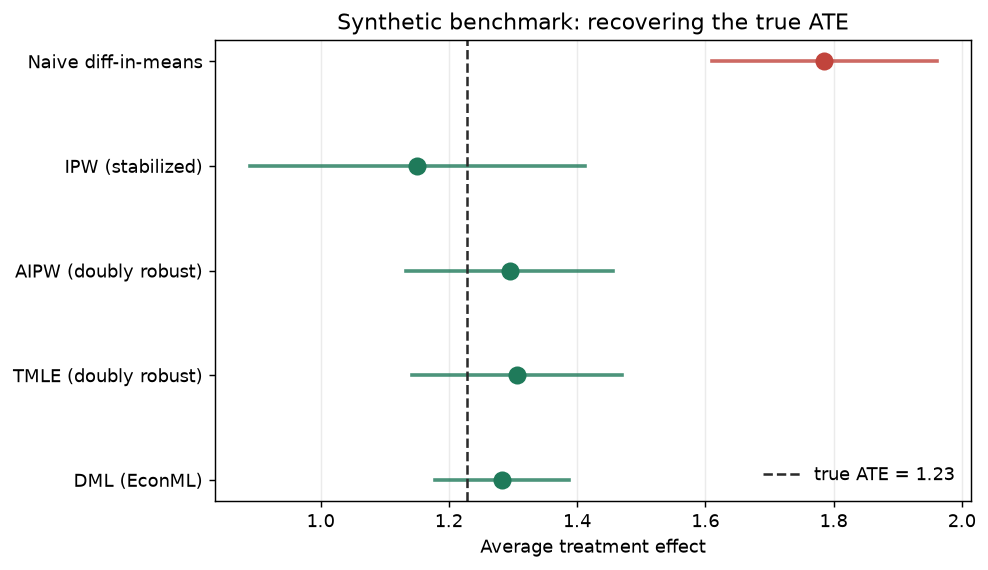
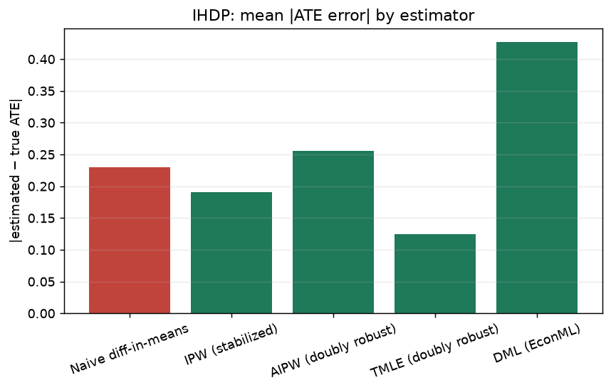
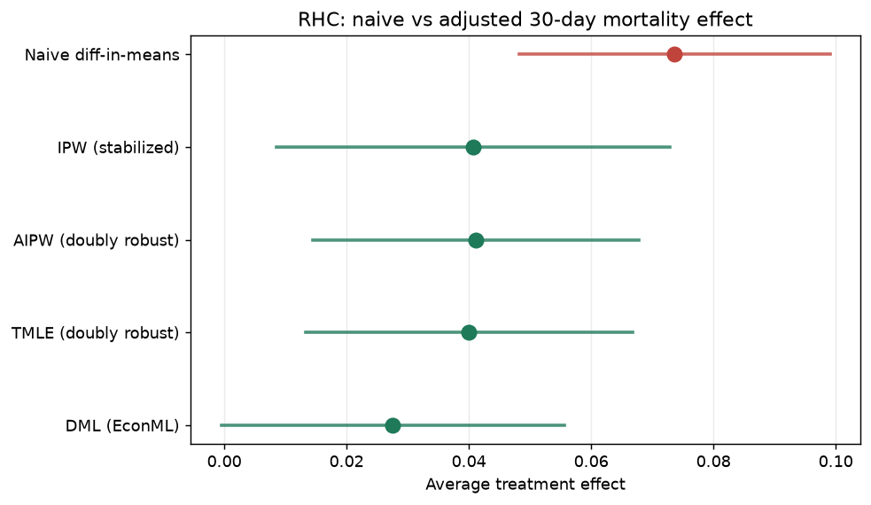
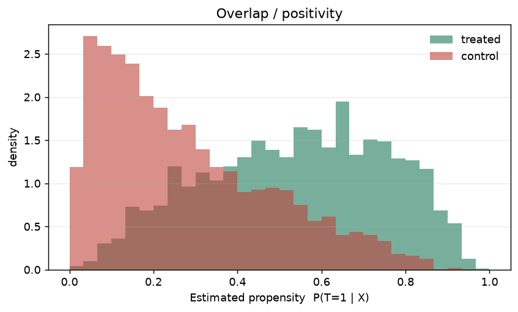
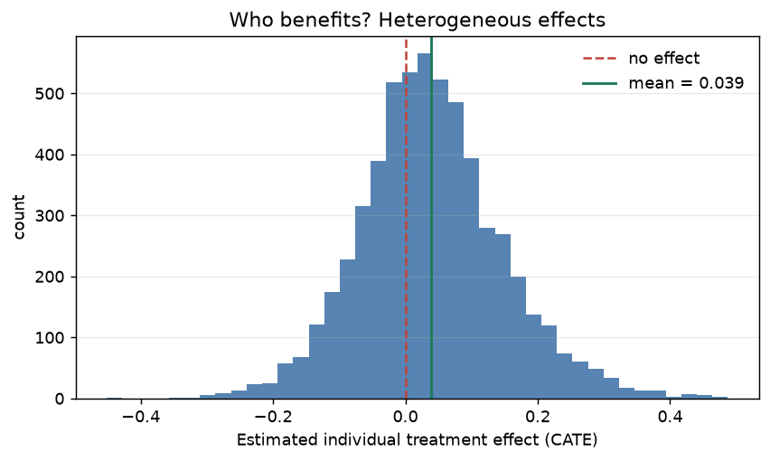
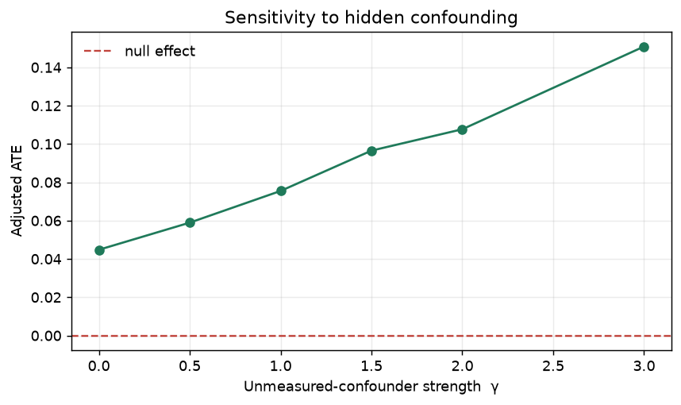

<div align="center">

# ⚖️ Veritas

### A causal-inference & real-world-evidence engine

*Recovering the true effect of a treatment from **observational, confounded** data —
and proving it against ground truth.*

[](https://www.python.org/)
[](tests/)
[](https://github.com/py-why/EconML)
[](https://github.com/py-why/dowhy)
[](LICENSE)

### 🔴 [**Live interactive dashboard → shaswatk45.github.io/Veritas**](https://shaswatk45.github.io/Veritas/)

*Toggle the benchmarks, drag the confounder slider, and read the evidence — no install.*

</div>

---

> **Randomized trials are the gold standard. Most decisions aren't randomized.**
>
> In observational data, treated and untreated groups differ systematically —
> sicker patients get the aggressive therapy — so naive correlation gives the
> wrong answer, sometimes the **wrong sign**. Veritas recovers the true causal
> effect anyway, estimates *who* it helps, stress-tests the finding against hidden
> bias, and turns it into a treatment decision.

<div align="center">

**Naive is off by ~8×.  Doubly-robust recovers the truth within 5%.**



</div>

On synthetic data with a **known** effect of `1.23`, the naive difference-in-means
lands at `1.79` (off by 45%), while the doubly-robust estimators cluster right on
the true-effect line. Because the truth is known, this is measured — not asserted.

---

## Table of contents

- [Why this project](#why-this-project)
- [Results](#results) · [benchmarks](#1-ground-truth-benchmarks) · [case study](#2-case-study--right-heart-catheterization) · [honesty](#3-how-honest-is-it-sensitivity)
- [What's inside](#whats-inside)
- [Architecture](#architecture)
- [Quickstart](#quickstart)
- [The interactive dashboard](#the-interactive-dashboard)
- [Method notes](#method-notes-the-part-that-matters)
- [Repo layout](#repo-layout)
- [Scope decisions](#scope-decisions)

---

## Why this project

Real-World Evidence (RWE) is the discipline of estimating causal effects from
observational data — *does the therapy work in the real population, for which
patients, and what's the next-best action?* It's the core of pharma /
healthcare advanced-analytics consulting, and the single rarest skill a data
portfolio can demonstrate: **causal reasoning, not just prediction.**

Most portfolios stop at prediction, or at propensity matching. Veritas goes the
whole way:

| | Most projects | **Veritas** |
|---|---|---|
| Target | predict `P(outcome)` | estimate the **causal effect** `E[Y¹−Y⁰]` |
| Confounding | ignored | **doubly-robust** adjustment (AIPW / TMLE) |
| Heterogeneity | — | **CATE** (Causal Forest / DML / X-learner) — *who* benefits |
| Honesty | — | **E-value** + refutation tests for hidden bias |
| Proof | test-set accuracy | **PEHE / ATE error vs ground truth** |
| Output | a number | a **whom-to-treat policy** with its value |

---

## Results

### 1. Ground-truth benchmarks

Because the **IHDP** benchmark and the **synthetic confounded DGP** carry the true
individual effects, every accuracy claim is a measurement.

**Synthetic (true ATE = 1.23):**

| Estimator | ATE | \|error\| | rel. error |
|---|--:|--:|--:|
| Naive diff-in-means | 1.79 | 0.557 | **45%** |
| IPW (stabilized) | 1.15 | 0.078 | 6.3% |
| **AIPW** (doubly robust) | 1.30 | 0.066 | **5.4%** |
| **TMLE** (doubly robust) | 1.31 | 0.078 | 6.4% |
| DML (EconML) | 1.28 | 0.054 | 4.4% |

> The naive estimate carries **8.4× the error** of AIPW. Confounding, removed.

**IHDP (averaged over 12 replications):**

| Estimator | mean \|ATE error\| | rel. error | 95% CI coverage |
|---|--:|--:|--:|
| Naive diff-in-means | 0.230 | 3.6% | 0.92 |
| IPW (stabilized) | 0.190 | 3.5% | 1.00 |
| AIPW (doubly robust) | 0.256 | 5.3% | 1.00 |
| **TMLE** (doubly robust) | **0.125** | **2.6%** | 1.00 |
| DML (EconML) | 0.427 | 8.2% | 0.67 |

Best CATE model: **X-learner, PEHE 2.04**. (IHDP is only mildly confounded, so
even naive isn't disastrous here — the doubly-robust estimators still win, and
their confidence intervals actually *cover* the truth, unlike DML's.)

<div align="center"></div>

### 2. Case study — Right Heart Catheterization

> **Does inserting a right-heart (Swan-Ganz) catheter change 30-day mortality in
> critically ill ICU patients?** — Connors et al., *JAMA* 1996. 5,735 patients,
> ~60 baseline covariates.

Sicker patients are far more likely to be catheterized, so the naive comparison
is badly confounded — the textbook RWE problem.

<div align="center"></div>

| Estimator | Δ 30-day mortality | 95% CI |
|---|--:|--:|
| Naive diff-in-means | **+7.4 pp** | — |
| IPW (stabilized) | +4.1 pp | — |
| **AIPW** (doubly robust) | **+4.1 pp** | [+1.4, +6.8] |
| TMLE (doubly robust) | +4.0 pp | — |
| DML (EconML) | +2.8 pp | — |

Adjustment removes about **half** the apparent harm — but a real, significant
effect persists: RHC is associated with **~4 pp higher** 30-day mortality (the
classic Connors finding, recovered from scratch). The overlap plot shows exactly
*why* the naive number is wrong — treated patients skew to high treatment
propensity:

<div align="center"></div>

**Who is most affected? (CATE quartiles)** — the average hides the individuals:

| CATE quartile | n | mean effect | interpretation |
|---|--:|--:|---|
| Q1 (most helped) | 1,434 | **−9.2 pp** | RHC *reduces* mortality |
| Q2 | 1,433 | +0.3 pp | ~no effect |
| Q3 | 1,434 | +6.6 pp | modest harm |
| Q4 (most harmed) | 1,434 | **+18.0 pp** | strong harm (sickest patients) |

<div align="center"></div>

### 3. How honest is it? (sensitivity)

The part most portfolios skip. No observational study can rule out a hidden
confounder — so we quantify how strong one would have to be.

- **E-value = 1.52** (point), **1.27** (CI limit): an unmeasured confounder would
  need a risk-ratio association of at least **1.52 with *both*** catheterization
  and mortality — beyond everything already adjusted for — to explain the effect away.
- **DoWhy refutation — all three tests pass:**

| Test | What it checks | Result |
|---|---|:--:|
| Placebo treatment | fake treatment → effect should vanish | ✅ pass |
| Random common cause | add a noise covariate → effect should hold | ✅ pass |
| Data subset (80%) | re-estimate on a subset → effect should be stable | ✅ pass |

<div align="center"></div>

---

## What's inside

- **Doubly-robust ATE** — `IPW`, **`AIPW`**, **`TMLE`** (two chances to be right:
  the outcome model *or* the propensity model), plus **`DML`** — all cross-fitted,
  with influence-function confidence intervals.
- **Heterogeneous effects (CATE)** — X-learner, EconML **Causal Forest** and
  **Double ML** — *who* benefits, scored by **PEHE** against ground truth.
- **Sensitivity analysis** — **E-value** + a simulated unmeasured confounder.
- **Causal graph + refutation** — **DoWhy**: state the assumptions as a DAG,
  identify the estimand (backdoor), then *try to break it*.
- **Policy learning** — turn CATE into a whom-to-treat rule and value it
  (doubly-robust).
- **Ground-truth validation harness** — IHDP + a synthetic confounded DGP,
  scored by PEHE and ATE error.
- **An interactive dashboard** — a self-contained HTML console + a Streamlit app.

---

## Architecture

```
 benchmarks (IHDP + synthetic, ground truth) ──► validation harness (PEHE, ATE error)
        │
 DoWhy causal graph (assumptions) ─► identification (backdoor) ─► refutation tests
        │
 ATE:  naive  vs  IPW  vs  AIPW / TMLE (doubly robust)  vs  DML        [cross-fitted]
        │
 CATE: X-learner, Causal Forest, Double ML ─► who benefits (subgroups)
        │
 sensitivity: E-value + simulated unmeasured confounder
        │
 policy: CATE ─► treat / don't-treat rule ─► doubly-robust policy value
        │
 case study: RHC observational data ─► one clear clinical question, end to end
        │
 report + dashboard: bias-vs-corrected, overlap, CATE subgroups, sensitivity
```

---

## Quickstart

> **Windows PowerShell** does not support `&&` — run each line separately.
> Calling the venv's Python directly avoids any activation / execution-policy issues.

```powershell
py -3.12 -m venv .venv
.\.venv\Scripts\python.exe -m pip install -r requirements.txt
.\.venv\Scripts\python.exe -m pip install -e .

# Full run: ground-truth benchmarks + the RHC case study (downloads IHDP + RHC, then caches):
.\.venv\Scripts\python.exe -m veritas.pipeline --reps 15

# Estimator-correctness tests (naive is biased, doubly-robust recovers truth):
.\.venv\Scripts\python.exe -m pytest -q

# Build the self-contained dashboard, then open reports/veritas_dashboard.html:
.\.venv\Scripts\python.exe -m veritas.export_frontend
```

<details>
<summary><b>macOS / Linux</b></summary>

```bash
python3.12 -m venv .venv
.venv/bin/python -m pip install -r requirements.txt -e .
.venv/bin/python -m veritas.pipeline --reps 15
.venv/bin/python -m pytest -q
```
</details>

Outputs land in `reports/`: `report.md` (the headline), `results.json`, six
figures, and `veritas_dashboard.html`.

---

## The interactive dashboard

**▶ Live: [shaswatk45.github.io/Veritas](https://shaswatk45.github.io/Veritas/)** — the
project's own interactive site (hosted on GitHub Pages).

`python -m veritas.export_frontend` renders a **single self-contained HTML file**
(no server, no dependencies) driven by the pipeline's results — an interactive
benchmark forest plot (synthetic ⇄ IHDP), the RHC case with propensity overlap,
the CATE subgroup table, an **E-value sensitivity slider** with a bias
tipping-point, the DoWhy refutation checklist, and the causal DAG. It's published
to `docs/index.html` for Pages, and a live **Streamlit** version is also included:

```powershell
.\.venv\Scripts\python.exe -m streamlit run src\veritas\dashboard\app.py
```

---

## Method notes (the part that matters)

- **Cross-fitting.** Every doubly-robust estimator uses *out-of-fold* nuisance
  predictions ([`estimate/nuisance.py`](src/veritas/estimate/nuisance.py)) — a
  unit's nuisance is never predicted by a model that saw it — so flexible ML
  models don't invalidate the inference.
- **Honest TMLE.** The targeting step is a real one-parameter logistic
  fluctuation with the clever covariate `H = T/e − (1−T)/(1−e)`, solved by Newton
  iteration, with the SE from the efficient influence curve
  ([`estimate/ate.py`](src/veritas/estimate/ate.py)) — not a library call.
- **Positivity.** Propensities are trimmed to `[clip, 1−clip]`, and the overlap
  plot makes the assumption *visible* rather than assumed.
- **AIPW** is the mean of the efficient influence function
  `μ₁−μ₀ + T(Y−μ₁)/e − (1−T)(Y−μ₀)/(1−e)`; the SE is its sample standard error.
- **Validation, not vibes.** IHDP and the synthetic DGP carry the true individual
  effects, so PEHE and ATE error are *measured*.

---

## Repo layout

```
veritas/
├─ README.md
├─ src/veritas/
│  ├─ benchmarks/   # IHDP + synthetic DGP loaders; PEHE / ATE-error metrics
│  ├─ identify/     # DoWhy causal graph, identification, refutation tests
│  ├─ estimate/     # cross-fit nuisances; IPW, AIPW, TMLE, DML; X-learner, Causal Forest
│  ├─ sensitivity/  # E-value + simulated unmeasured confounder
│  ├─ policy/       # CATE → treatment rule → doubly-robust policy value
│  ├─ casestudy/    # RHC (Connors 1996) applied analysis
│  ├─ dashboard/    # Streamlit app
│  ├─ pipeline.py   # end-to-end run → results.json + report + figures
│  └─ export_frontend.py   # builds the self-contained HTML dashboard
├─ frontend/        # HTML template for the dashboard
├─ notebooks/       # 01 benchmark validation · 02 RHC case study  (# %% cell scripts)
└─ tests/           # estimator + metric correctness (incl. "naive is biased")
```

---

## Scope decisions

- **Case study = RHC** (Right Heart Catheterization) rather than raw NHANES — it's
  the textbook observational-confounding example, clinically clean, and reliably
  hosted. The causal machinery is entirely dataset-agnostic.
- **ACIC** is represented by a synthetic ACIC-style confounded DGP with known
  ground truth (the real competition files are fragile to fetch); it doubles as
  the oracle for the estimator-correctness tests.
- The learned-policy value is evaluated in-sample and is therefore mildly
  optimistic; cross-fitting the policy is a noted next step.

---

## Acknowledgements & data

- **IHDP** benchmark — Hill (2011); replications via [fredjo.com](https://www.fredjo.com/).
- **RHC** — Connors et al., *JAMA* 1996; via [Vanderbilt Biostatistics](https://hbiostat.org/data/).
- Built on [EconML](https://github.com/py-why/EconML) and [DoWhy](https://github.com/py-why/dowhy) (PyWhy).

## License

MIT — see [LICENSE](LICENSE).
